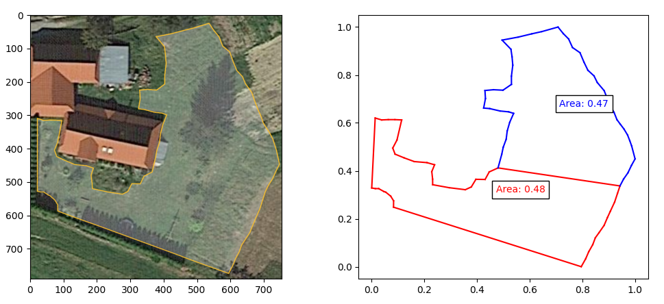

# convex-hull
Graham scan and Jarvis march implementations.

I've found them very useful while working with the Google Earth API. I was able to settle a local issue about dividing
land into equal sections for land mowing with a custom Jarvis March and exhaustive search based optimization algorithm.

Useful maths:
* https://en.wikipedia.org/wiki/Shoelace_formula
